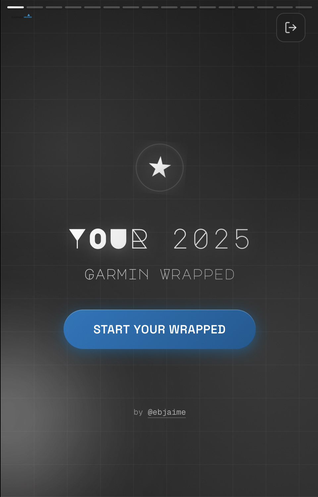
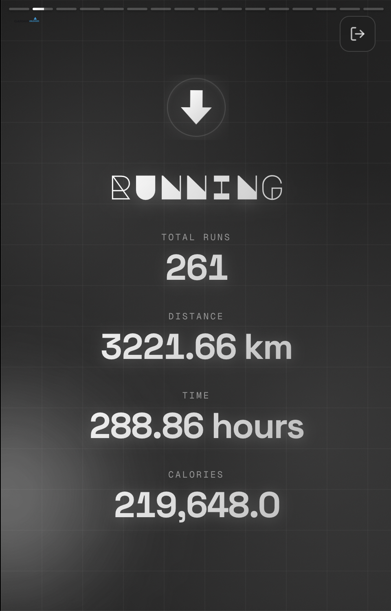
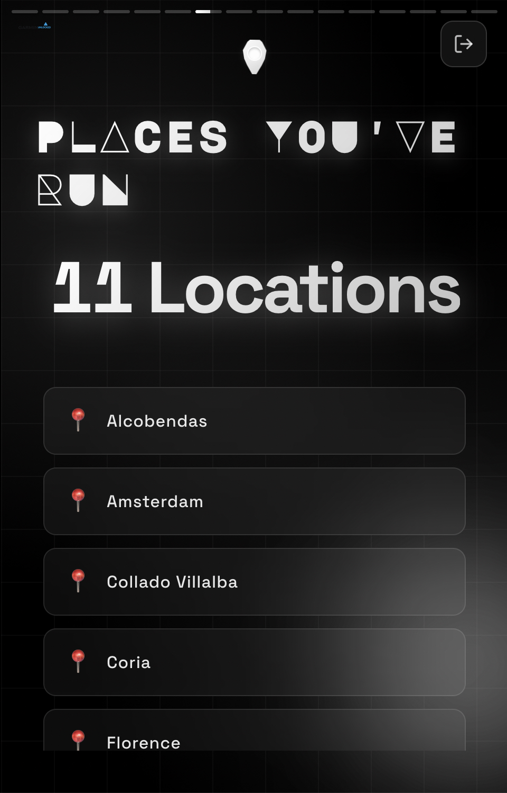
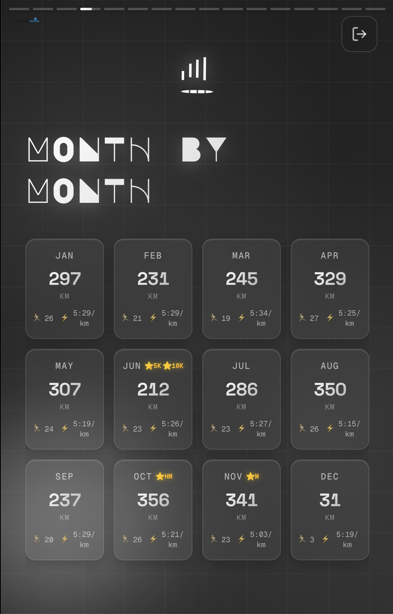
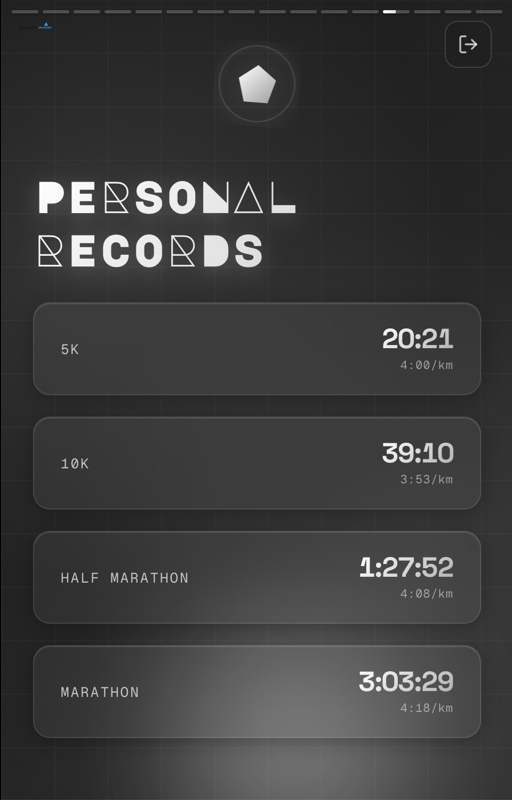
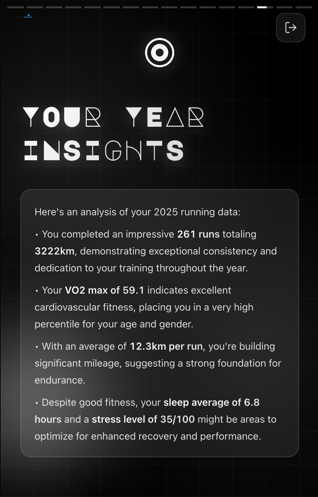
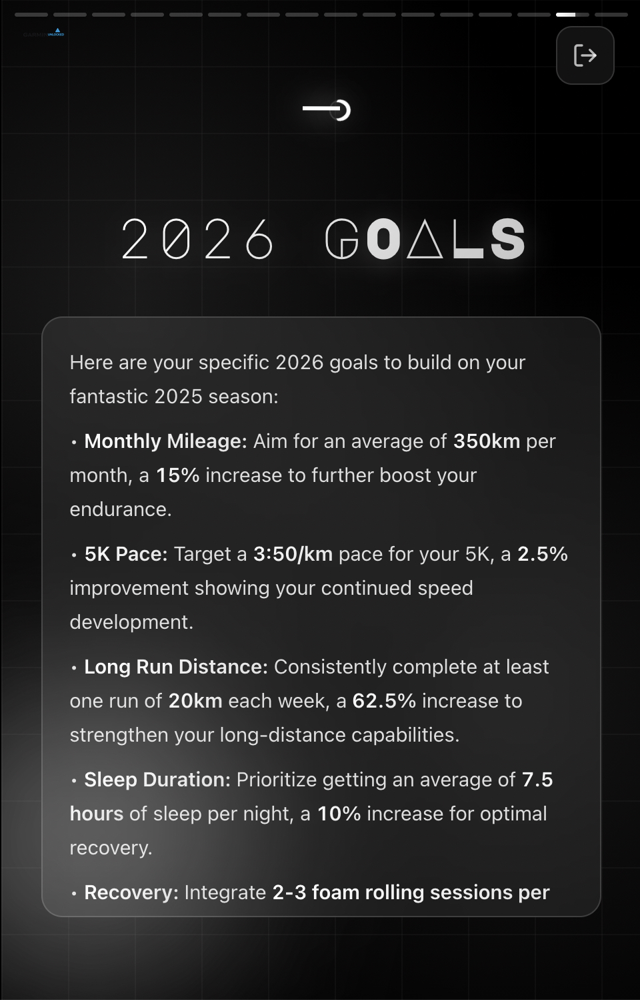

# 🔓 Garmin Unlocked

<p align="center">
  
</p>

Unlock the full story of your fitness journey. A Spotify Wrapped-style year-in-review that transforms your Garmin data into an immersive, Instagram Stories experience. Discover your achievements, track your progress, and celebrate your 2025 fitness milestones.

🌐 **Try it now for free at [garmin-unlocked.space](https://garmin-unlocked.space)**


## ✨ Features

- **📊 Comprehensive Stats**: Total runs, distance, time, calories, and more
- **🗺️ Locations Tracked**: See all the countries and places where you've run
- **🏆 Personal Records**: Track your 5K, 10K, Half Marathon, and Marathon PRs
- **📅 Monthly Breakdown**: Compare your performance month-by-month throughout 2025
- **🤖 AI-Powered Insights**: Personalized analysis using Google Gemini AI
- **🎯 2026 Goals**: AI-generated recommendations for next year
- **💪 Fitness Metrics**: VO2 Max tracking and Training Load analysis
- **😴 Sleep Analysis**: Sleep quality, duration, deep sleep, and REM sleep
- **❤️ Health Monitoring**: Resting heart rate, stress levels, and body battery
- **👟 Step Tracking**: Daily steps, averages, and milestone achievements
- **🔒 Secure Login**: Session-based authentication with Garmin Connect
- **💾 Smart Caching**: Saves your wrapped data and AI insights for instant reloads
- **📱 Mobile Optimized**: Instagram Stories-style swipe navigation, responsive design for all devices
- **🎨 Beautiful Design**: Chrome/matte aesthetic with animated backgrounds

## 📱 Preview

<p align="center">
  
  
  
</p>

<p align="center">
  
  
</p>

<p align="center">
  
  
</p>

## 🚀 Getting Started

### Prerequisites

- Python 3.13 or higher
- A Garmin Connect account with activity data from 2025

### Installation

1. **Clone the repository**
   ```bash
   git clone https://github.com/ebjaime/garmin-wrapped.git
   cd garmin-wrapped
   ```

2. **Create a virtual environment**
   ```bash
   python3 -m venv env
   source env/bin/activate  # On Windows: env\Scripts\activate
   ```

3. **Install dependencies**
   ```bash
   pip install -r requirements.txt
   ```

4. **Configure environment variables (optional)**
   ```bash
   cp .env.example .env
   # Edit .env and add your Gemini API key for AI insights
   # Get a free API key at: https://aistudio.google.com/apikey
   ```

5. **Run the application**
   ```bash
   python app.py
   ```

6. **Open your browser**
   Navigate to `http://localhost:5000`

## 📱 Usage

1. **Login**: Enter your Garmin Connect credentials
2. **Wait**: The app fetches and analyzes your 2025 data
3. **Explore**: Swipe through your personalized wrapped stories
4. **Navigate**: 
   - Tap left side to go back
   - Tap right side to go forward
   - Hold to pause
   - Use arrow keys on desktop

## 🛠️ Tech Stack

- **Backend**: Flask (Python 3.13)
- **Frontend**: Vanilla JavaScript, HTML5, CSS3
- **Data Source**: Garmin Connect API (via garminconnect library)
- **AI**: Google Gemini 2.5 Flash Lite for personalized insights
- **Fonts**: Major Mono Display, Space Grotesk, Geist Mono
- **Storage**: Local JSON caching (or Google Cloud Storage for production)

## 📂 Project Structure

```
garmin-unlocked/
├── app.py                 # Flask application & routes
├── main.py               # Garmin data fetching & analysis (parallel)
├── storage.py            # Storage backend (local/GCS)
├── requirements.txt      # Python dependencies
├── .env.example          # Environment variables template
├── templates/
│   ├── index.html       # Main wrapped interface
│   └── login.html       # Login page
├── static/
│   └── logo_big.png     # Application logo
├── users/               # Cached wrapped data (gitignored)
└── insights/            # Cached AI insights (gitignored)
```

## 🔐 Security & Privacy

- **Authentication**: Credentials validated with Garmin servers on each login
- **Sessions**: Encrypted Flask sessions that expire after 30 days (or on logout)
- **Data Storage**: User data cached locally in `users/` and `insights/` folders
- **API Keys**: Gemini API key stored in `.env` (never committed to repository)
- **Privacy**: All data stays on your machine (or your own cloud storage if deployed)

## 🎨 Design Features

- **Typography**: Major Mono Display for titles, Space Grotesk for stats, Geist Mono for monospace
- **Color Scheme**: Dark gradients with metallic chrome accents
- **Animations**: Morphing background blobs that follow mouse movement
- **Icons**: Custom CSS geometric shapes (no emoji dependencies)
- **Responsive**: Fully optimized for all devices (tested on iPhone SE, tablets, desktop)
- **Progressive**: 10-second story duration with auto-advance and manual navigation

## ⚡ Performance

- **Parallel Data Fetching**: Fetches all data sources simultaneously for faster load times
- **Smart Caching**: Wrapped data and AI insights cached to prevent redundant API calls
- **Optimized Mobile**: Responsive design with smooth scrolling and touch gestures

## 🤝 Contributing

Contributions are welcome! Please feel free to submit a Pull Request.

## 📄 License

This project is licensed under the MIT License.

## 🙏 Acknowledgments

- Built with [garminconnect](https://github.com/cyberjunky/python-garminconnect) library
- AI insights powered by [Google Gemini](https://ai.google.dev/)
- Inspired by Spotify Wrapped
- Fonts: Major Mono Display, Space Grotesk, and Geist Mono by Google Fonts

## 👤 Author

**@ebjaime**
- GitHub: [@ebjaime](https://github.com/ebjaime)

---

**Note**: This is an unofficial project and is not affiliated with or endorsed by Garmin Ltd. or its affiliates.
